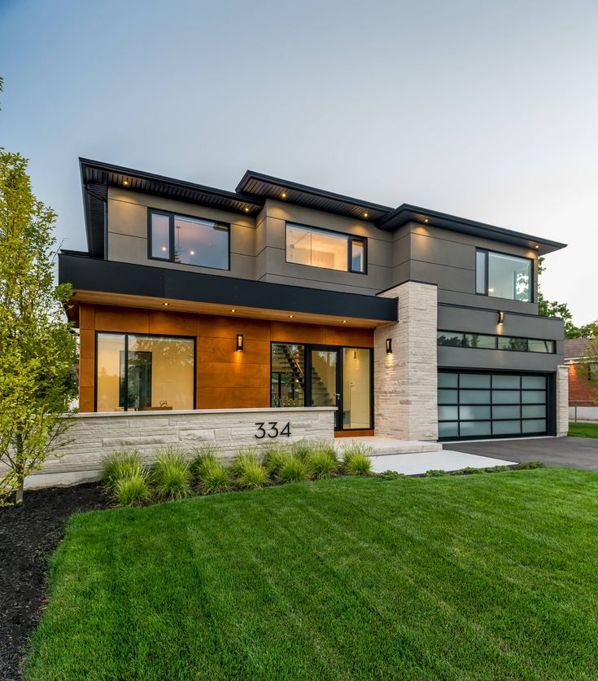

# Kingsukh Guesthouse Website

A modern and responsive website for **Kingsukh Guesthouse**, built from scratch to showcase services, gallery, and other key information.

---

## 🌐 Live Demo
Experience the live site here: [Kingsukh Guesthouse Live Demo](https://kingsukh-huesthouse.netlify.app)

---

## Features
- Fully responsive layout for desktop and mobile
- Image gallery showcasing the guesthouse
- Services section with clear descriptions
- Smooth scrolling and clean UI design
- Built entirely from scratch using **React** and **Bootstrap**

---

## Tech Stack
- **Frontend:** React
- **Styling:** CSS, Bootstrap
- **Deployment:** Netlify

---

## Screenshots



---

## Installation & Setup
1. Clone the repository:
   ```bash
   git clone https://github.com/yourusername/your-repo-name.git
